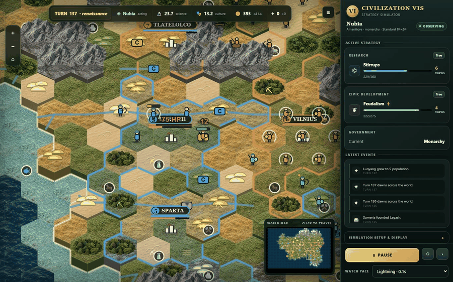

# CIVVIS

## Martin Halvorson's Civilization VIS (6.5)



*Spectate mode: eight AI civilizations fight a live exhibition match in the
browser GUI — here, a renaissance-era war around Corinth.*

An open-source, **headless-first** 4X strategy engine inspired by the mechanics
of Civilization VI — aiming to be for Civ 6 what [Unciv](https://github.com/yairm210/Unciv)
is for Civ 5. Designed **AI-simulator-first**: every game runs without a UI at thousands of turns per second, behind a JSON action protocol, so advanced AI
strategies (RL, MCTS, LLM agents) can be developed against it.

**Pure Rust, zero runtime dependencies** (serde only). Not affiliated with
Firaxis or 2K; no assets, art, text, or code from Civilization VI are used.

## What's implemented (v0.6)

- Hex map, random continents, climate bands, features, resources, fog of war
- Stock Civ VI map-size profiles (dimensions, players/city-states, natural
  wonders, continents, and religion caps)
- Cities: Civ 6 growth curve, border expansion, **housing & amenities**
- **Districts with adjacency bonuses**, buildings, improvements, builder charges
- Complete Gathering Storm-style **technology and civics trees** (77
  technologies and 61 civics spanning Ancient through Future)
  with **Eureka/Inspiration boosts** (data-driven triggers)
- Units with **XP/levels and fortify**, per-unit sight; melee/ranged/bombard
  combat and **zone of control** with Civ 6 math; city sieges, capture, and
  **city and Encampment ranged strikes**
- The full standard **naval roster** from Galleys through Nuclear Submarines,
  with naval melee/ranged/raider/carrier classes and staged sea access
- Data-driven **class promotion trees**, **Corps/Armies**, and linked escorts
- **Theological combat** with Missionaries, Apostles, Gurus, Inquisitors,
  religious pressure, healing, inquisition, heresy removal, and condemnation
- **Barbarians** (camps, era-scaled raiders), **city-states**, **governments**
- War/peace; all six Civ VI victory paths: **domination, science, culture,
  religious, diplomatic, and score**
- Deterministic per seed; full JSON save/serialization
- Moddable ruleset: all content in `data/*.json` (Unciv-style)
- **Browser GUI** for human vs AI; **Elo tournament harness** for rating AIs

## Build & play

```bash
cargo build --release
./target/release/civvis play --players 4        # browser GUI; you are player 0
```

For an unattended spectator that checks for new code only between games:

```bash
python3 tools/spectator_supervisor.py --players 4
```

It keeps the result reachable for at least 10 seconds, checks the current Git
upstream, safely fast-forwards when possible, rebuilds local edits too, and
automatically starts the next game. Builds happen while the completed result
server remains available; a promoted runtime is reused immediately when it
already matches the source. Active matches are atomically checkpointed every
five seconds. If the server crashes or stops responding, the supervisor resumes
that checkpoint; if the same state repeatedly freezes, it quarantines the save
and starts a fresh match instead of entering a restart loop. It also nudges a
simulation that stops advancing, while browser requests use timeouts and retry
after temporary server outages.

The supervisor fingerprints all runtime inputs before and after compilation.
If code changes during the build or the newest source does not compile, the
known-good result/game stays available while it waits and retries.

Player-count defaults use Civ VI's stock world rows: 2 players = Duel
(`44×26`, 3 city-states), 4 = Tiny (`60×38`, 6 city-states), and 6 = Small
(`74×46`, 9 city-states). `--width`, `--height`, and `--city-states` remain
available as explicit advanced overrides.

GUI: click/right-click to select and order units, drag to pan, wheel to zoom,
**1** next action, **2** settler lens, **3** map tacks, Enter ends turn; tech
and civics tree maps, production/buy panels, city strikes, fog of war. Enable
**Show yields per tile** in View & controls (or press **Y**); gold-outlined yield
chips identify tiles currently worked by the automatic citizen governor.

Each city's citizen governor protects its food requirement, then optimizes the
remaining population for the city's current build/specialty and its
civilization ability. The active focus and worked tiles are included in city
observations under `citizens` and shown in the city panel.

## Headless AI

```bash
./target/release/civvis simulate --players 4 --seed 42   # AI self-play
./target/release/civvis soak --games 20 --turns 150      # many games, flag anomalies
./target/release/civvis benchmark --games 100            # turns/sec
./target/release/civvis tournament --ais advanced,basic --games 40 # Elo ratings
cargo run --release --bin ai_eval -- advanced basic --pairs 100   # paired seats
./target/release/civvis evolve --generations 100 --pop 24 --games 12 \
  --threads 8 --dir evolved                              # evolve full strategy + doctrine
```

`AdvancedAi` coordinates nearby units into domain-specific armies and fleets
with shared muster, advance, focus-fire, hold, and recovery orders that replan
between battlefield actions. The genetic runner evolves those group-combat
doctrine parameters together with expansion, production, diplomacy, and
tactical exchange weights; archived champions and a fixed-seed validation gate
keep the `evolved` agent from promoting narrow or regressive strategies.

In-process Rust agents implement one trait:

```rust
use civvis::{ai::Ai, game::{Action, Game}};

struct MyBot;
impl Ai for MyBot {
    fn take_turn(&mut self, g: &mut Game, pid: usize) {
        for a in g.legal_actions(pid) { /* pick */ }
        let _ = g.apply(pid, &Action::EndTurn);
    }
}
```

Rate it: `civvis::elo::run_tournament(&names, |name, seed| ..., &cfg)`.

External agents (any language, incl. Python) drive the same JSON protocol over
HTTP: `civvis play --no-open` then `GET /state` (observation + legal_actions),
`POST /action {"action": {"type": "move", "unit": 3, "to": [1, -2]}}`.
See [docs/AI_GUIDE.md](docs/AI_GUIDE.md).

## Layout

```
src/        engine crate (game.rs = turn engine + action protocol,
            ai.rs, elo.rs, mapgen.rs, obs.rs, server.rs, ...)
data/       moddable ruleset JSONs (terrain, units, districts, projects, techs, ...)
web/        single-file browser GUI (vanilla JS, served by src/server.rs)
docs/       architecture, AI guide, roadmap
```

## Docs

- [ARCHITECTURE.md](docs/ARCHITECTURE.md) — design, action protocol, turn lifecycle
- [AI_GUIDE.md](docs/AI_GUIDE.md) — building and rating agents
- [ROADMAP.md](docs/ROADMAP.md) — path to full Civ 6 parity

## License

MIT
